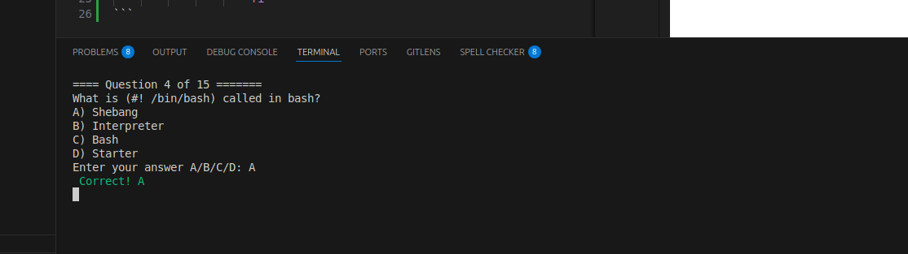

# Terminal Quiz Game

## Project description
This is a command-line game built with bash where a user is able answer an interactive quiz on the terminal, also able to record their score, track their longest winning streak on the MCQs and finally get a final score in percentage.

**Code snippet**

```bash
#Checking that the right input option is provided
                while true; do
                    read -r -p "Enter your answer A/B/C/D: " answer
                    # In case the answer is lowercase, convert to uppercase
                    answer=$(echo "$answer" | tr '[:lower:]' '[:upper:]') 
                    if [[ $answer =~ ^[ABCD]$ ]]; then
                        break
                    else
                        echo -e "${RED}Invalid input Please select either the letter: A, B, C, or D ${RESET}"
                    fi
                done
                    if [[ $answer == "$correct" ]]; then
                        echo -e "${GREEN} Correct!!${RESET}"
                        score=$((score + 1))
                        win_streak=$((win_streak + 1 ))
                        num_of_correct_ans=$((num_of_correct_ans + 1))
                    else
                        echo -e "${RED} Incorrect. The correct answer is $correct${RESET}"
                        num_of_incorrect_ans=$((num_of_incorrect_ans + 1))
                    fi
```

### Preview of answer.



## About
The game is programmed such that a player chooses to either a *play competitive quiz mode* or a *non-competitive practice mode*. The quiz mode tracks the player's score, longest winning streak and save the high scores whereas the practice mode does not track high scores.

## Installation 
This game is built using bash programming language. To play the game;
- You can get a copy of the game at [this repository](https://github.com/AsohLove/Terminal-Quiz-Game.git)
- Change to the project directory(cd) on the terminal or command-line
- Run `./quiz.sh` to launch the game


## Author

**Love Asoh**

- GitHub: [@loveasoh](https://github.com/AsohLove)
- Twitter: [@loveasoh](https://x.com/LoveTheModifier)
- LinkedIn: [love asoh](https://www.linkedin.com/in/asohlove/)


## License
This project is [MIT](./LICENSE) licensed.